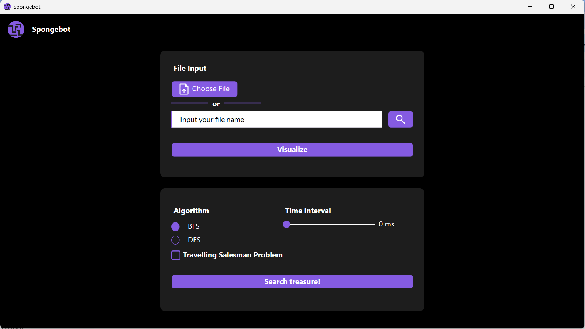
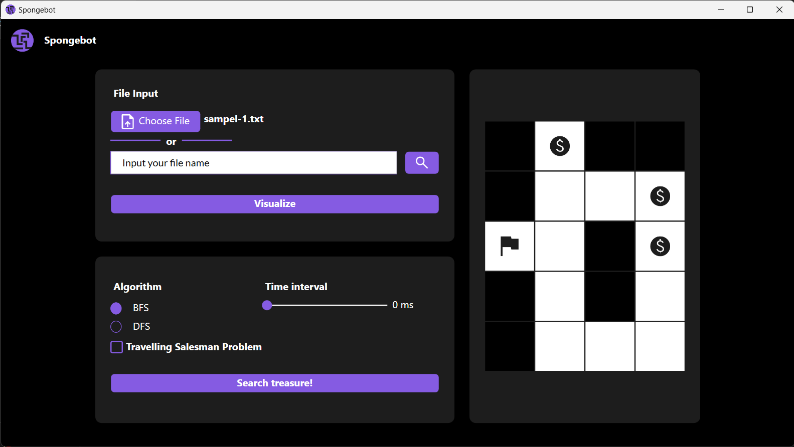
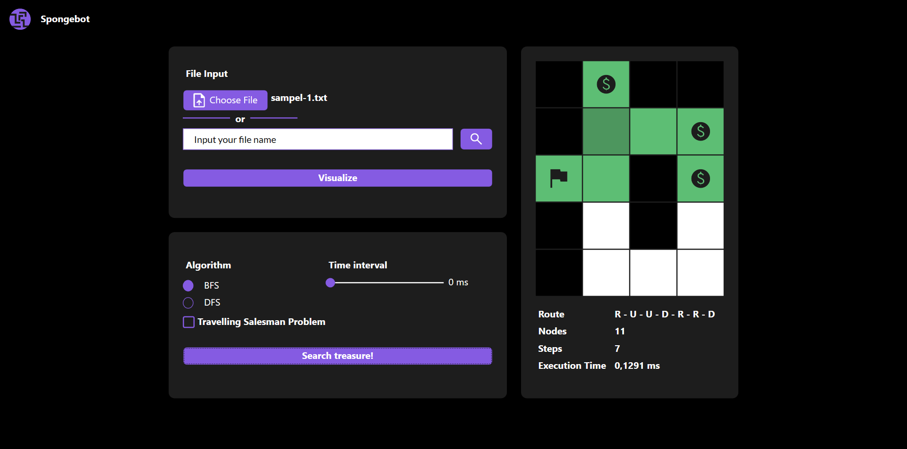
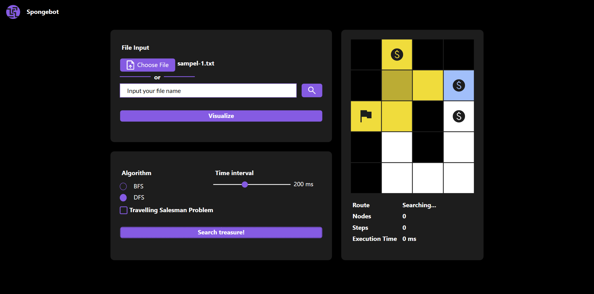

# Tubes2_Spongebot
## Tugas Besar IF2211 Strategi Algoritma

## **Table of Contents**
* [General Information](#general-information)
* [Requirements](#requirements)
* [How to Run and Build (Windows)](#how-to-run-and-compile-windows)
* [Screenshot](#screenshot)
* [Program Structure](#program-structure)
* [Author](#author)

## **General Information**
>Finding treasure(s) in a maze can be solved by using search algorithm. Maze used by the program is a *n x m* maze which user can input their custom maze from a .txt file. Here are the symbol of the maze:

| Symbol    | Description |
|------------|--------------|
| K | Start Point |
| R | Routes |
| T | Treasure |
| X | Wall |

In this repository, the solution to find the treasure(s) in mazae problem is implemented using the *TSP, BFS, and DFS* algorithm. Program will display the path of solution in GUI.

## **Requirements**
To use this program, you will need to install **.Net** (https://dotnet.microsoft.com/en-us/download) on the device you are using. You will also need **Visual Studio** (https://visualstudio.microsoft.com/) to be installed before running the program.

## **How to Run and Build (Windows)**
### **Setup**
1. Clone this repository <br>
```sh 
$ git clone https://github.com/liviaarumsari/Tubes2_Spongebot
```
2. Open this repository in terminal
### **Build (optional)**
1. Change your directory to the project directory 
```sh 
$ cd src/Spongebot
```
2. Build the solution
```sh 
$ dotnet build Spongebot.csproj
```
3. Your build result will be in the 'bin' folder

### **Run**
You can directly open Spongebot.exe from 'bin' folder or you can follow these steps:

1. Change the directory to the 'bin' folder <br>
```sh 
$ cd bin
```
2. Run the application using this command
```sh 
$ dotnet Spongebot.dll
```


## **Screenshot**







## **Program Structure**
```
.
│   .gitignore
│   README.md
│
├───bin
│       Spongebot.deps.json
│       Spongebot.dll
│       Spongebot.exe
│       Spongebot.pdb
│       Spongebot.runtimeconfig.json
│
├───doc
│       fig1.png
│       fig2.png
│       fig3.png
│       fig4.png
│       Tubes2_K2_13521094_Spongebot.pdf
│
├───src
│   └───Spongebot
│       │   App.xaml
│       │   App.xaml.cs
│       │   AssemblyInfo.cs
│       │   MainWindow.xaml
│       │   MainWindow.xaml.cs
│       │   Spongebot.csproj
│       │   Spongebot.csproj.user
│       │   Spongebot.sln
│       │
│       ├───Algorithms
│       │       BFS.cs
│       │       DFS.cs
│       │
│       ├───Enums
│       │       CellType.cs
│       │
│       ├───Exceptions
│       │       Exceptions.cs
│       │
│       ├───Fonts
│       │       Lato-Black.ttf
│       │       Lato-Bold.ttf
│       │       Lato-Regular.ttf
│       │
│       ├───Images
│       │       chooseFileImg.png
│       │       logoImg.ico
│       │       logoImg.png
│       │       searchImg.png
│       │       startImg.png
│       │       treasureImg.png
│       │
│       ├───IO
│       │       FileIO.cs
│       │
│       ├───Objects
│       │       Board.cs
│       │       Cell.cs
│       │       MazePath.cs
│       │       Point.cs
│       │
│       └───Properties
│               Resources.Designer.cs
│               Resources.resx
│
└───test
        sampel-1.txt
        sampel-2.txt
        sampel-3.txt
        sampel-4.txt
        sampel-5.txt
        sampel-6.txt
        sampel-7.txt
        sampel-8.txt

```

## Authors

| Name                  | GitHub                                            | NIM                  |
| --------------------- | ------------------------------------------------- | --------------------- |
| Alexander Jason       | [AJason36](https://github.com/AJason36)           | 13521100 |
| Angela Livia Arumsari | [liviaarumsari](https://github.com/liviaarumsari) | 13521094 |
| Rinaldy Adin   | [Rinaldy-Adin](https://github.com/Rinaldy-Adin)           | 13521134 |
